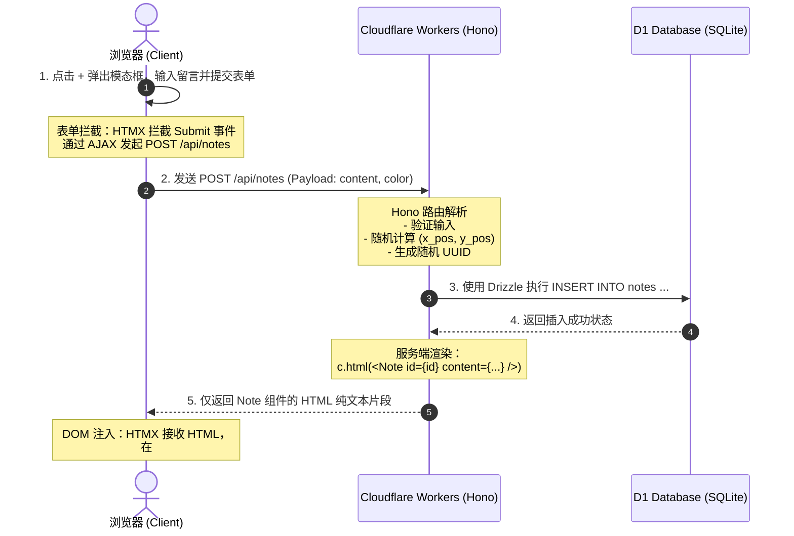

# 📌 实时匿名留言墙 (Live Sticky Notes Board)

这是一个基于 **Hono + Cloudflare Workers + D1 Database + Drizzle ORM + HTMX** 架构打造的全栈、轻量级、高交互实时留言墙应用。

本项目旨在展示如何抛弃臃肿的传统客户端框架（如 React/Next.js 的 Hydration 机制），利用**边缘计算（Edge Computing）**和**超轻量级 HTML-over-the-wire 交互技术**，构建一个冷启动接近 0ms、具备强类型安全且可全球低延迟同步的全栈应用。

---

## ⚡ 项目核心优势与技术选型

1.  **极速冷启动**：使用 Hono（<14KB 路由引擎）部署在 Cloudflare Workers 上，依靠 V8 Isolate 沙箱技术，冷启动可达 0ms - 10ms。
2.  **拟物化交互**：留言便签支持多配色（马卡龙色系）、自适应屏幕百分比坐标拖拽定位、原地双击无刷新编辑。
3.  **零成本实时同步**：结合 **HTMX 轮询** 与前端拖拽状态锁（`window.isDragging`），实现多客户端低延迟位置与内容同步，且 100% 运行在 Cloudflare 免费额度内。
4.  **边缘端类型安全**：采用 Drizzle ORM 实现纯 TypeScript 定义的表结构与类型安全数据库查询。

## 🚀 快速启动指令序列 (Quick Start Commands)

若要快速重新跑通或初始化该项目，以下是**从零初始化到本地运行**的完整命令步骤序列（可依次复制执行）：

```bash
# 1. 在当前空目录初始化 Hono (Cloudflare Workers) 项目模板并安装默认依赖
npm create hono@latest . -- --template cloudflare-workers --pm npm --install

# 2. 安装 Drizzle ORM 以及开发/类型定义工具
npm install drizzle-orm
npm install -D drizzle-kit typescript @cloudflare/workers-types

# 3. [此时需要修改 wrangler.jsonc 和创建 drizzle.config.ts 配置文件]

# 4. 根据 TypeScript Schema 生成建表 SQL 迁移文件
npx drizzle-kit generate

# 5. 应用本地 D1 数据库 SQL 迁移（终端提示输入 y 确认）
npx wrangler d1 migrations apply live-notes-db --local

# 6. 生成本地数据库 bindings 的 TypeScript 类型声明文件
npm run cf-typegen

# 7. 启动本地开发服务器，启动完成后访问 http://localhost:8787 即可
npm run dev
```

---

## 🛠️ 从零搭建与命令步骤详解

本章节记录了本项目从零初始化的完整指令及各组件在架构中扮演的角色。

### 1. 初始化 Hono 模板
```bash
npm create hono@latest . -- --template cloudflare-workers --pm npm --install
```
*   **为什么执行此步**：使用 Hono 官方的脚手架直接在当前目录初始化项目。`--template cloudflare-workers` 会为我们创建专门运行在 Cloudflare Workers 平台上的代码模版；`--pm npm --install` 则指定使用 npm 作为包管理器并在初始化时自动安装基础依赖包（如 `hono`）。

### 2. 安装核心依赖与开发工具
```bash
npm install drizzle-orm
npm install -D drizzle-kit typescript @cloudflare/workers-types
```
*   **`drizzle-orm`**：**核心查询构建器**。用于在 TypeScript 代码中执行类型安全的 SQL 查询。它是纯 JS 编写，没有复杂的 C++ 编译文件或二进制包，体积极小，能在 Edge 运行时运行。
*   **`drizzle-kit`**：**数据库迁移管理命令行工具（devDependency）**。主要用于对比我们编写的 TypeScript 表结构定义（Schema）与现有数据库状态，自动生成 SQL 迁移脚本文件。
*   **`typescript`**：**TS 编译器（devDependency）**。确保我们编写的类型安全代码可以通过本地命令进行独立类型检查，提升 IDE 自动补全质量。
*   **`@cloudflare/workers-types`**：**Cloudflare 平台类型声明（devDependency）**。它将 Cloudflare 的全局环境对象（如 `D1Database` 类型）注入到本地 TS 编译器中，使得 `c.env.DB` 能够在开发时获得正确的 API 自动补全。

### 3. 配置数据库与 Wrangler CLI
在 `wrangler.jsonc` 中添加 D1 数据库配置：
```json
"d1_databases": [
  {
    "binding": "DB",
    "database_name": "live-notes-db",
    "database_id": "c168f18d-6e8d-4e92-944a-f3e0c06173dc"
  }
]
```
*   **什么是 D1 数据库**：Cloudflare 提供的托管版 Serverless SQLite 数据库。
*   **`binding`**：绑定变量名。在 Workers 代码中，我们将通过 `c.env.DB` 来直接读写该数据库。
*   **`database_id`**：本地调试时填写的占位符 UUID。部署到云端时，将通过命令生成的真实云端 ID 替换。

### 4. 生成 Drizzle 配置与迁移文件
在根目录编写 `drizzle.config.ts`：
```typescript
import { defineConfig } from 'drizzle-kit';

export default defineConfig({
  schema: './src/db/schema.ts',
  out: './migrations',
  dialect: 'sqlite',
});
```
运行生成与应用迁移：
```bash
# 1. 根据 schema 生成 SQL 迁移脚本
npx drizzle-kit generate

# 2. 将迁移脚本应用到本地模拟的 D1 数据库中
npx wrangler d1 migrations apply live-notes-db --local

# 3. 根据 wrangler 配置为 Worker 自动同步全局环境变量类型声明
npm run cf-typegen
```
*   **`drizzle-kit generate`**：它会扫描 `schema.ts`，并在 `migrations/` 目录下生成类似 `0000_xxx.sql` 的建表脚本。
*   **`wrangler d1 migrations apply ... --local`**：将刚刚生成的建表 SQL 语句，真实执行在本地 `.wrangler` 文件夹中模拟的 SQLite 文件上。
*   **`cf-typegen`**：利用 `wrangler` 读取配置文件中的 `DB` 绑定，自动将 `D1Database` 类型生成至 `worker-configuration.d.ts`，以便项目获得完美类型提示。

---

## 📁 目录结构说明

```text
/
├── migrations/                 # Drizzle Kit 自动生成的 SQL 数据库建表与迁移脚本文件
├── src/
│   ├── components/             # Hono JSX 服务端组件文件夹
│   │   ├── Layout.tsx          # 页面 HTML 框架（引入 Tailwind CSS、HTMX 库及核心过渡样式）
│   │   ├── Board.tsx           # 留言墙大画布（负责承载贴纸列表、绑定拖拽 JS 事件、定时 HTMX 轮询）
│   │   ├── Note.tsx            # 单个便签卡片（处理卡片配色、自适应倾斜、双击编辑触发、删除触发）
│   │   ├── NoteModal.tsx       # 新建留言模态框（使用 Tailwind 毛玻璃高质感，集成表单提交逻辑）
│   │   └── NoteEditForm.tsx    # 行内编辑表单（双击内容时，替换文字节点为输入框的局部渲染表单）
│   ├── db/
│   │   ├── schema.ts           # Drizzle 数据库 Schema（定义 notes 表的字段、数据类型及默认值）
│   │   └── index.ts            # Drizzle D1 数据库初始化连接助手
│   └── index.tsx               # Hono 服务端入口文件（负责路由匹配、API 开发与 JSX 页面的拼接返回）
├── drizzle.config.ts           # Drizzle Kit 工具链配置文件
├── tsconfig.json               # TypeScript 编译器配置文件（包含 Hono JSX 的专有路径解析）
├── worker-configuration.d.ts   # Wrangler 自动生成的全局环境变量/数据库绑定类型定义文件
└── wrangler.jsonc              # Cloudflare Workers 本地及云端部署的核心配置文件（D1 数据库绑定）
```

---

## 🔄 程序运行机制与数据流说明

项目没有采用传统的 SPA（单页应用，加载数 MB 编译后的 JS 去做客户端渲染），而是采用了 **HTML-over-the-wire（HTML 传输线）** 模式。

### 核心流：发布新留言的数据生命周期



1.  **客户端发起请求**：用户在前端提交留言表单时，表单上的 `hx-post="/api/notes"` 让 **HTMX** 拦截了默认提交，通过 `fetch` 在后台向 Hono 服务端发送异步请求。
2.  **服务端处理**：Cloudflare Workers 上的 Hono 接收请求，通过 `crypto.randomUUID()` 生成 ID，并使用随机数在 `15%` 到 `75%` 范围生成 `xPos` 和 `yPos`（防止多张卡片重叠）。
3.  **数据库落库**：Drizzle 构建插入语句将数据持久化在 **D1** 中。
4.  **局部组件渲染**：Hono 并不是返回 `{ success: true }` 的 JSON，而是**直接调用服务端的 JSX 引擎**将 `<Note />` 组件渲染成纯 HTML 字符串返回。
5.  **前端局部置换**：HTMX 收到响应，找到配置的 `hx-target="#board-notes-container"`，在不重刷网页的情况下，将接收到的 HTML 结构通过 `hx-swap="beforeend"` 插入到 DOM 节点，并附带平滑的动画。

---

### 🎨 拖拽保存与实时同步的避免冲突机制

#### 拖拽保存：
我们在 `Board.tsx` 中使用了**事件委托（Event Delegation）**。不需要为每个便签单独绑定监听器，而是由父容器监听 `mousedown` / `touchstart` 事件。
当释放鼠标（`mouseup` / `touchend`）时，JS 会计算贴纸左上角相对于整个大看板的百分比（如 `left: 45.2%`），并向后端发起 `PUT /api/notes/:id/position` 存储最新坐标，确保移动端与 PC 端在不同屏幕下都能成比例地呈现位置。

#### 实时同步与避免冲突（HTMX 轮询锁）：
*   在 `Board.tsx` 的容器上配置了 `hx-trigger="every 3s"`，HTMX 会每 3 秒发起一次 `GET /api/notes/list` 拉取全量贴纸 HTML 更新板面，实现其他客户端的被动同步。
*   **防止拖拽时跳动（核心设计）**：为了防止用户在拖拽贴纸时，3 秒时间正好到了，轮询将贴纸的位置“强制刷新并跳回原地”，我们监听了 HTMX 的生命周期钩子：
    ```javascript
    document.addEventListener('htmx:beforeRequest', function(evt) {
      if (evt.detail.target.id === 'board-notes-container' && window.isDragging) {
        evt.preventDefault(); // 当用户处于拖拽状态时，取消 HTMX 的轮询网络请求
      }
    });
    ```
    这样，只要用户在移动卡片，`window.isDragging` 就会为 `true`，轮询被临时静音。松开鼠标后，轮询自动恢复。

---

## 💾 本地开发与数据库实用命令

### 1. 启动本地开发服务
```bash
npm run dev
```
此命令在后台调用 `wrangler dev`，它会自动载入 `wrangler.jsonc` 配置文件，并在本地 `http://localhost:8787` 启动由 Miniflare 支持的模拟 Worker & D1 环境。

### 2. 执行本地 SQL 查询 (不借助可视化界面)
你可以使用 `wrangler d1 execute` 命令行直接在终端中对本地的模拟 D1 数据库执行查询：
```bash
# 查询本地数据库中现有的所有留言记录
npx wrangler d1 execute live-notes-db --local --command "SELECT * FROM notes;"

# 清空本地所有的留言数据
npx wrangler d1 execute live-notes-db --local --command "DELETE FROM notes;"
```
*   **`--local`**：该参数至关重要，它指示命令执行于本地模拟的 SQLite 数据库，而不是去连接 Cloudflare 的云端生产环境。

---

## 🚀 生产环境部署与云端数据库配置

将应用从本地环境部署到 Cloudflare 生产环境，需要完成以下云端数据库配置和发布流程。

### 1. 配置 Cloudflare API Token（适合远程/虚拟机开发）
在远程开发环境或 CI/CD 容器中，Wrangler 默认的 OAuth 浏览器授权可能会因端口无法转发而失败。推荐使用 Cloudflare API 令牌进行认证：
1. 打开并登录 [Cloudflare API 令牌管理面板](https://dash.cloudflare.com/profile/api-tokens)。
2. 创建一个基于 **“编辑 Cloudflare Workers”** 模板的 Token。
3. **关键补充**：编辑该 Token 的权限，手动**额外添加一条账户级权限**：`帐户 (Account) -> D1 -> 编辑 (Edit)`，然后保存。
4. 在开发终端中导出该环境变量以供 Wrangler 使用：
   ```bash
   export CLOUDFLARE_API_TOKEN="您的_CLOUDFLARE_API_TOKEN"
   ```

### 2. 创建线上 D1 数据库
使用授权的 CLI 在 Cloudflare 云端创建真实的 D1 数据库实例：
```bash
npx wrangler d1 create live-notes-db
```
*   **说明**：创建成功后，Wrangler 会输出该数据库在云端的真实 **`database_id`**（例如 `982cce60-535c-4a41-82ec-b6116ff08ba7`）。

### 3. 更新 wrangler.jsonc 配置
将上一步生成的真实云端 `database_id` 填入 [wrangler.jsonc](file:///home/fx/Develop/hono/wrangler.jsonc) 中，保持 `binding` 仍然为代码中使用的 **`DB`**：
```json
"d1_databases": [
  {
    "binding": "DB",
    "database_name": "live-notes-db",
    "database_id": "982cce60-535c-4a41-82ec-b6116ff08ba7"
  }
]
```

### 4. 应用远程数据库迁移
使用本地生成的 SQL 脚本在云端 D1 数据库中初始化表结构：
```bash
npx wrangler d1 migrations apply live-notes-db --remote
```
*   **注意**：此步骤必须带上 `--remote` 参数，并在终端提示时输入 `y` 确认，以确保表结构同步到云端数据库中。

### 5. 一键发布与域名配置
执行发布命令，将全栈 Hono 代码编译并部署至 Cloudflare 边缘计算节点：
```bash
npm run deploy
```
*   **说明**：发布成功后，终端会输出形如 `https://live-notes.[你的子域].workers.dev` 的线上访问地址。

#### 💡 如何自定义您的子域名 (Subdomain)
若想将网址改成定制化的 `https://live-notes.fanxiao.workers.dev`：
1. 登录 Cloudflare Dashboard，在左侧菜单进入 **Workers 和 Pages** 页面。
2. 滚动到页面底部的 **Account Details**（账户详情）。
3. 找到 **“子域 (Subdomain)”** 这一行，点击右侧的 **“铅笔（编辑）”** 图标。
4. 将子域前缀修改为您的专属标识（例如 `fanxiao`）并保存。保存后，刚才部署的项目无需重新打包，即可立即通过新子域 `https://live-notes.fanxiao.workers.dev` 访问！

---

## 📅 如何进行数据库表结构变更 (Schema Migrations)

**重要原则**：在 Serverless 和 Edge 环境中，**“修改代码重新部署”并不会自动变更云端的数据库结构**。代码的逻辑演进与数据库的表结构演进是相互独立的，必须显式触发迁移。

当您由于业务调整需要对数据库进行**增/删/改字段**时，请严格按照以下标准化流程操作：

### 1. 第一步：修改 TypeScript 结构定义
在代码文件 [src/db/schema.ts](file:///home/fx/Develop/hono/src/db/schema.ts) 中直接对表结构进行增删改。例如，为留言板增加一个 `tag`（标签）字段：
```typescript
export const notes = sqliteTable('notes', {
  id: text('id').primaryKey(),
  content: text('content').notNull(),
  tag: text('tag').default('未分类'), // 新增字段
  // ... 其他字段
});
```

### 2. 第二步：在本地生成 SQL 变更脚本
运行 Drizzle Kit CLI 对比 Schema 变化，并在 `migrations/` 目录下生成对应的 SQL 升级脚本：
```bash
npx drizzle-kit generate
```
*   **说明**：Drizzle Kit 会自动生成类似于 `0001_xxx.sql` 的文件，内容类似于 `ALTER TABLE notes ADD COLUMN tag TEXT DEFAULT '未分类';`。

### 3. 第三步：将变更应用到本地与云端 D1 数据库
您必须分别将 SQL 迁移脚本应用到您的本地数据库及云端 D1 数据库：
```bash
# A. 应用到本地开发测试用的 SQLite 数据库
npx wrangler d1 migrations apply live-notes-db --local

# B. 应用到 Cloudflare 生产环境的云端 D1 数据库 (提示时输入 y 确认)
CLOUDFLARE_API_TOKEN="您的_API_TOKEN" npx wrangler d1 migrations apply live-notes-db --remote
```
*   **注意**：在这一步执行完毕前，千万不要部署使用新字段的业务代码，否则线上服务会因找不到字段而崩溃。

### 4. 第四步：编写业务逻辑并重新部署代码
当数据库表结构变更在云端应用成功后，您可以修改您的 API 路由（如 `src/index.tsx`）去读写新字段，然后运行部署命令：
```bash
npm run deploy
```

---

## 🤖 GitHub Actions CI/CD 自动化部署指南

为了实现多人协作时的“持续集成与自动部署 (CI/CD)”，我们已经在项目根目录配置了 GitHub Actions 自动化工作流：[.github/workflows/deploy.yml](file:///home/fx/Develop/hono/.github/workflows/deploy.yml)。

一旦配置完成，**您每次向 GitHub 的 `main` 分支推送代码，GitHub 服务器都会全自动执行类型检查、云端数据库迁移同步和 Hono Worker 全栈代码部署。**

### 1. 配置 GitHub 密钥 (Secrets)
由于构建过程需要访问您的 Cloudflare 账户，您需要在 GitHub 仓库中配置您的 API 密钥：
1. 打开您的 GitHub 仓库页面（例如：`https://github.com/BIGMAX-RKO007/live-notes`）。
2. 进入顶部的 **Settings**（设置）标签页。
3. 在左侧菜单栏中选择 **Secrets and variables** -> **Actions**。
4. 点击右上角的 **“New repository secret”** 按钮。
5. 填写密钥信息：
   *   **Name**: `CLOUDFLARE_API_TOKEN`
   *   **Secret**: 粘贴您从 Cloudflare 申请的那个包含 D1 和 Workers 编辑权限的 API Token。
6. 点击 **“Add secret”** 保存。

### 2. 触发自动化部署流
在本地终端中，只需执行标准的 Git 推送命令，即可触发云端自动化构建：
```bash
# 1. 暂存所有修改（包含最新的模块化重构代码与工作流配置文件）
git add .

# 2. 提交本地更改
git commit -m "refactor: implement modular Feature-Folder CSR architecture"

# 3. 推送至 GitHub
git push origin main
```
*   **说明**：推送完成后，您可以在 GitHub 仓库的 **Actions** 标签页中，实时看到编译、类型检查、D1 迁移、以及 Workers 部署的日志和结果，彻底告别本地终端网络差导致 Timeout 失败的问题！


